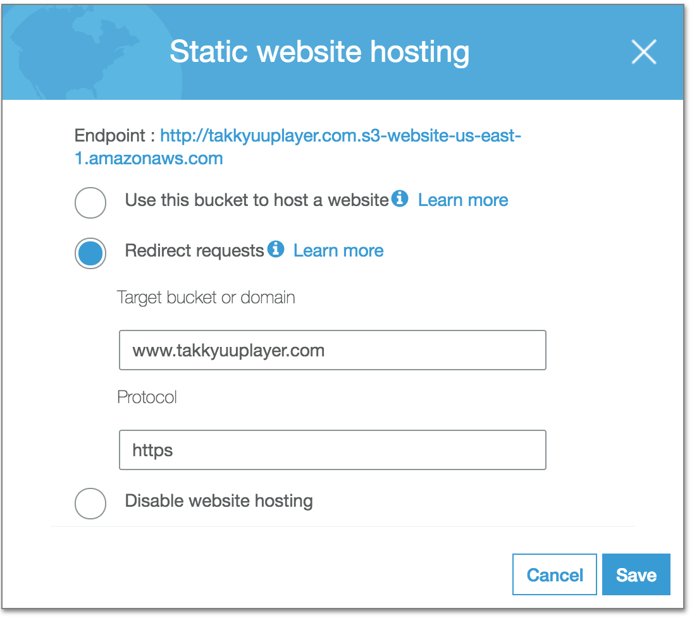

# [ Simple Storage Service \(S3\) ](https://aws.amazon.com/documentation/s3/)

This is 3rd entry of my advent calendar in 2017.

## Motivation

I'd like to redirect `http://takkyuuplayer.com` to `https://www.takkyuuplayer.com`.
How about hosting a static website on S3 for the purpose?
I'm using Route 53 so it must be possible.

## Let's use it

### S3 Settings

First, create a new bucket `takkyuuplayer.com` in **US East (N. Virginia)** region. I tried Tokyo region first but I couldn't set alias on Route 53 because console doesn't load S3 website as its target.
Configure the bucket as Static website hosting with a `Redirect requests` option, then all requests to
 http://takkyuuplayer.com.s3-website-us-east-1.amazonaws.com were redirected to https://www.takkyuuplayer.com

### Route 53 setting

Let's set up Route 53 so that `takkyuuplayer.com` can be an alias of `takkyuuplayer.com.s3-website-us-east-1.amazonaws.com`. Below document was helpful.

> [Step 3\.2: Add Alias Records for example\.com and www\.example\.com](http://docs.aws.amazon.com/AmazonS3/latest/dev/website-hosting-custom-domain-walkthrough.html#root-domain-walkthrough-switch-to-route53-as-dnsprovider)

Done. http://takkyuuplayer.com

## Consideration

### How is it convenient compared to using nginx?

S3 has capability to track access log

> [Server Access Logging \- Amazon Simple Storage Service](http://docs.aws.amazon.com/AmazonS3/latest/dev/ServerLogs.html)

but it is not flexible as like nginx. I like LTSV format but S3 can not handle it.

However, I don't need logging for the redirection so I prefer S3 as I'm free from server managements.

## Conclusion

LGTM to use S3 for the redirection.

## Prior Notice

Tomorrow entry is Cloudfront.

## P.S.

Leave comments on https://github.com/takkyuuplayer/aws-advent-calendar-2017/pull/4
