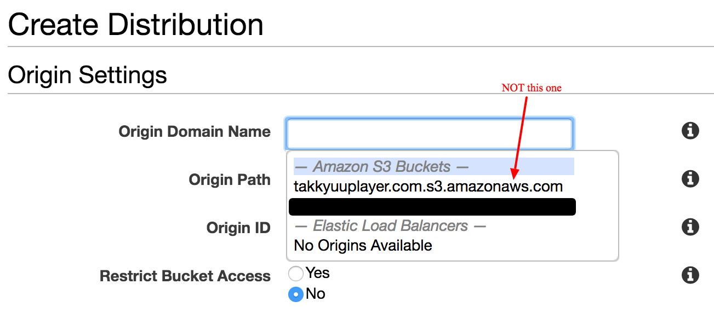
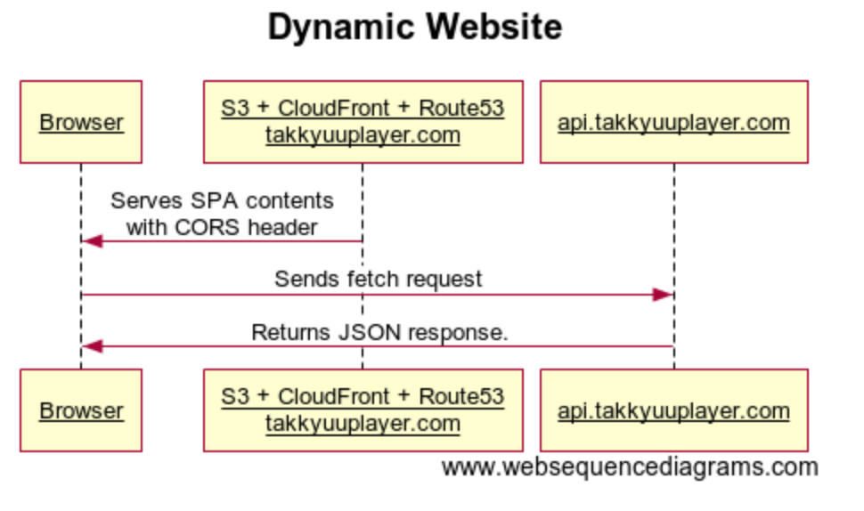

# [Amazon CloudFront](https://aws.amazon.com/cloudfront/?nc1=h_ls)

This is 4th entry of my advent calendar in 2017.

## Motivation

Yesterday I redirected `http://takkyuuplayer.com` to `https://www.takkyuuplayer.com`.
I'd like to do the same thing for HTTPS requests, too.

## Let's use it

Let's create a new distribution from [AWS CloudFront Management Console](https://console.aws.amazon.com/cloudfront/home?region=us-east-1) and choose `Web`.

1. Origin Settings

    * I was tricked by `Origin Domain Name` setting. I must use endpoint of static website hosting (http://takkyuuplayer.com.s3-website-us-east-1.amazonaws.com) instead of a S3 bucket auto completed.

    

1. Distribution Settings
    * Alternate Domain Names: takkyuuplayer.com
    * SSL Certificate: I used Custom SSL Certificate issued via ACM. It was easy to confirm domain as I'm using Route 53.
1. Route 53 Settings
    * I replaced Alias that I configured yesterday with cloudfront.

Done. https://www.takkyuuplayer.com/

## Consideration

### S3 + CloudFront + Route 53 structure for a website

We don't need to take care of server. It is a huge merit.

Furthermore, We also can host dynamic website by setting CORS on S3. Single Page Application is popular these days so below kind of structure would be nice.

## Conclusion

LGTM to use CloudFront + S3 + Route 53 structure.

## Prior Notice

Tomorrow, I'll try CloudFormation.
